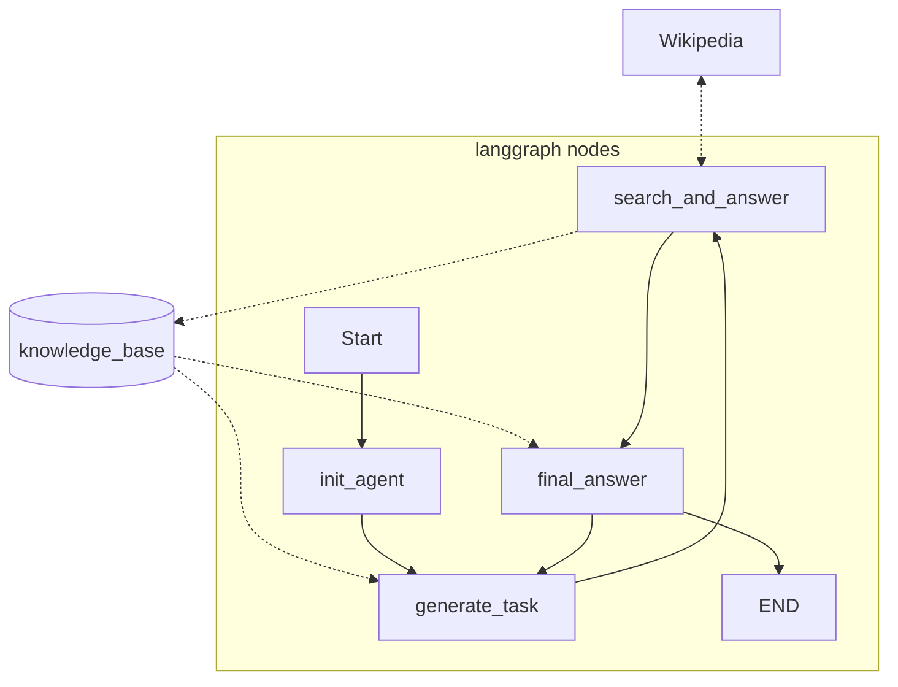

# AI-Agent-Wikipedia

LangGraphで実装された、回答に不足情報する情報をWikipediaから取得するエージェント。


### ノード説明
* init_agent
  * agentの状態を初期化するノード
* generate_task
  * ナレッジベースと質問をもとに、回答するために不足している知識を特定し、検索タスクを生成するノード。
* search_and_answer
  * Wikipediaに検索して、必要な情報をLLMで取得するノード。
* final_answer
  * ナレッジベースと質問をもとに、回答を生成するノード。
  * 回答できないときは回答不可と返答する。


### streamlit
```sh
streamlit run streamlit.py
```
